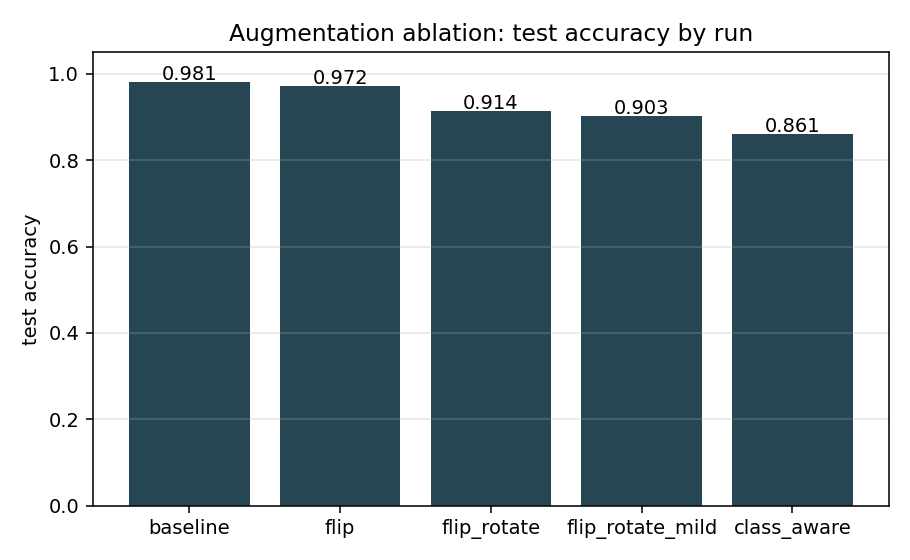
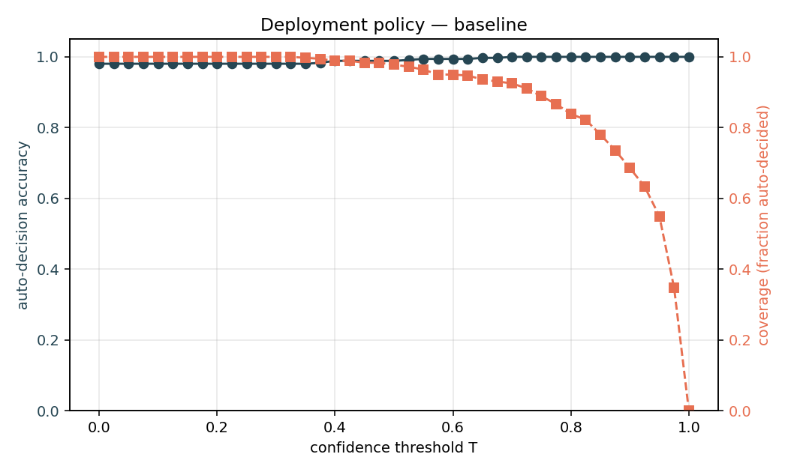
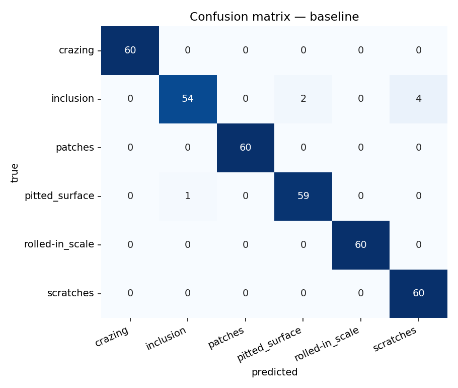
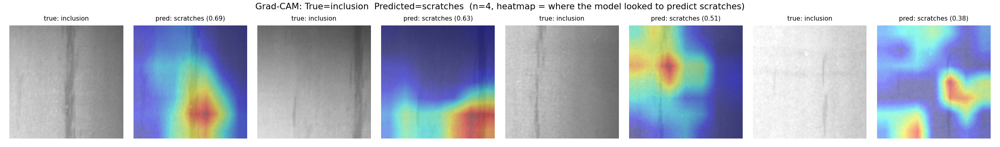
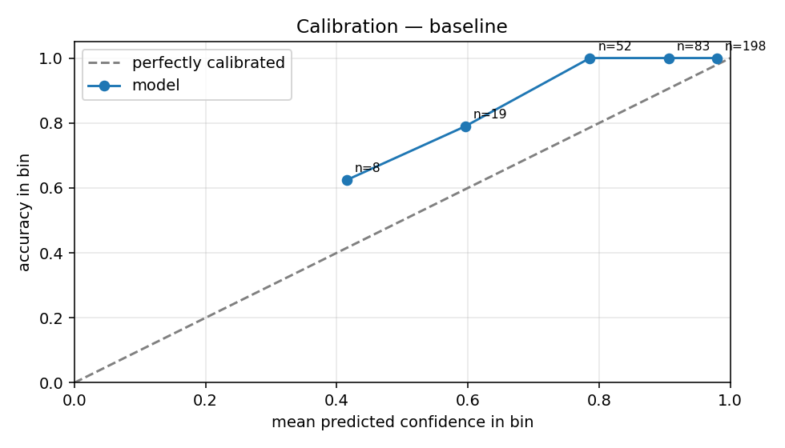
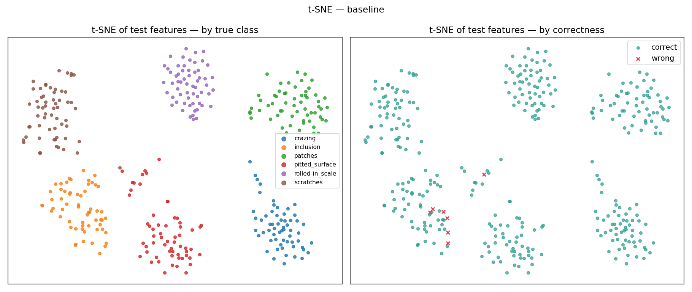

# Industrial Defect Classification — Failure Analysis

End-to-end failure analysis of a steel-surface-defect classifier on the
[NEU-CLS dataset](https://huggingface.co/datasets/newguyme/neu_cls)
(1,800 images, 6 defect classes). The interesting deliverable here is not the
model — a frozen ImageNet ResNet-18 with a linear head clears 98% test accuracy
in a few minutes on CPU — but the toolkit and report that systematically dissect
*where* and *why* the model fails, and quantify which "obvious" fixes actually
help.

## Headline results

Five training runs, ablating different augmentation policies on a 1,440-image
training set. All errors below are on a held-out test set of 360 images.

| Run                | Augmentation policy                            | Test accuracy |
|--------------------|------------------------------------------------|---------------|
| **baseline**       | none                                           | **0.9806**    |
| flip               | horizontal flip                                | 0.9722        |
| flip_rotate        | h-flip + ±15° rotation                         | 0.9139        |
| flip_rotate_mild   | h-flip + ±5° rotation                          | 0.9028        |
| class_aware        | rotation only on rotation-safe classes (hypothesis-driven) | 0.8611 |



**The headline finding is that every augmentation regime hurts on this dataset.**
The baseline (no augmentation) wins by 0.9 to 12 points depending on the
alternative. Even the hypothesis-driven `class_aware` policy — which I
designed *after* analysing per-class failures in `flip_rotate` and which does
recover inclusion recall as predicted (0.63 → 0.78) — fails overall, because
the regression on rotation-safe classes (`pitted_surface` recall 0.95 → 0.63)
swamps the gain. See [`findings.md`](findings.md) Section 3 for the full
trace from observation → hypothesis → experiment → re-evaluation.

This is a result that would not show up if you only looked at aggregate test
accuracy on the default augmentation pipeline — and it's the kind of thing
that quietly costs production deployments.

### Production-readiness summary

The baseline model isn't just accurate, it's *deployable*:

| Metric                                | Value                                  |
|---------------------------------------|----------------------------------------|
| Test accuracy                         | 98.06%                                 |
| **Confidence-thresholded auto-decision** | **100% accurate at T=0.70**         |
| Auto-decided coverage at that threshold | **92.5%** (333/360 frames)           |
| Defer-to-human rate                   | **7.5%** (27/360 frames)               |
| **CPU latency p50 (batch=1)**         | **47.9 ms / frame  →  20.9 FPS**       |
| CPU latency p50 (batch=32)            | 14.9 ms / frame  →  67.2 FPS           |
| Hardware                              | 8-core CPU, no GPU                     |

Coverage / accuracy curve, recommended threshold, and full latency table at
`reports/deployment/` and `reports/benchmark/latency.md`.



### Failure-mode visuals

Confusion matrix and Grad-CAM saliency on the dominant confused class pair
(`inclusion` mistaken for `scratches`):




The Grad-CAM heatmaps show the model is *not* getting distracted by background
artefacts — it's looking exactly at the elongated dark streaks, which on these
samples really do resemble scratches. So the residual error is a true visual
ambiguity, not a model attention problem. This is a deployment-relevant
distinction: it tells the team to invest in either an inclusion-vs-streak
auxiliary classifier or a relabelling pass on edge cases, *not* in retraining
the main model.

Calibration is reliable enough to use as the deployment signal:




## What's in the repo

```
src/
  data.py        NEU-CLS parquet loader, stratified split, ClassAwareDataset
  model.py       ResNet-18 backbone (frozen) + linear head, transforms
  train.py       Training loop with per-run config + artefact dump
  analyze.py     Failure-analysis toolkit (per-class, calibration, t-SNE, ...)
  gradcam.py     Grad-CAM saliency overlays for any run
  deployment.py  Coverage-vs-accuracy sweep + threshold recommendation
  benchmark.py   CPU latency benchmark across batch sizes
runs/<name>/
  config.json, metrics.json, model.pt, test_predictions.csv, test_features.npy
  analysis/
    per_class.{csv,png}, confusion_matrix.png, calibration.png, tsne.png
    confused_pairs/                 image galleries by (true, pred) pair
    hard_examples/                  high-conf-wrong + low-conf-right boards
    gradcam_confused_pairs/         Grad-CAM overlays for confused pairs
    gradcam_high_conf_wrong.png     Grad-CAM on the highest-conf errors
    summary.json
reports/
  ablation.{csv,png}                cross-run accuracy comparison
  deployment/coverage_accuracy.{csv,png}
  deployment/recommendation.json    recommended confidence threshold + coverage
  benchmark/latency.{json,md}       CPU inference benchmark
  summaries.json
findings.md                         narrative writeup of every failure mode
Makefile                            `make all` reproduces every artefact
requirements.txt
```

## Failure analysis toolkit

`src/analyze.py` produces the following per run:

1. **Per-class precision / recall / F1** with support — bar chart + CSV.
2. **Confusion matrix** as a heatmap.
3. **Confidence-binned accuracy** (calibration). The model is well-calibrated
   on the high-confidence regime (>0.7 confidence → 100% accurate, n=333) and
   uncertain on the long tail (<0.5 confidence → 62.5% accurate, n=8). All 7
   baseline errors have confidence under 0.7.
4. **Most-confused class-pair galleries.** For each of the top-3 off-diagonal
   confusion-matrix entries, dump up to 8 misclassified images sorted by model
   confidence — the fastest way to see whether a confusion is a *labelling
   problem* or a *real visual ambiguity*.
5. **Hard examples board.**
   - "High-confidence wrong": the model was sure but wrong (likely label noise
     or genuinely out-of-distribution samples).
   - "Low-confidence right": the model just barely got it (genuinely ambiguous
     samples worth showing the annotation team).
6. **t-SNE of penultimate features**, plotted twice: coloured by true class
   (cluster structure check) and by correctness (where do errors live in
   feature space?).
7. **Cross-run ablation table** — same metrics across all augmentation regimes,
   side by side.

`src/gradcam.py` adds Grad-CAM saliency overlays so you can see *which pixels*
the model used for any prediction. In practice this is what tells the
annotation team whether to relabel a sample or whether the visual signal is
genuinely ambiguous. Run with `python -m src.gradcam --run runs/baseline`.

`src/deployment.py` computes the coverage-vs-accuracy curve and recommends a
deployment threshold. Run with `python -m src.deployment --run runs/baseline`.

`src/benchmark.py` measures p50 / p95 inference latency on CPU across batch
sizes. Run with `python -m src.benchmark --run runs/baseline`.

All four operate on the artefacts emitted by `train.py`, so they work on
*any* run without re-training. That separation is intentional: in practice
you spend more time analysing runs than producing them.

## Reproducing

```bash
make setup     # creates .venv, installs CPU torch + deps
make data      # downloads the parquet files (~70 MB)
make train     # 5 runs × 6 epochs ≈ 25 min on 8-core CPU
make analyze   # writes analysis/ subdirs and reports/
```

Or, equivalently, `make all`.

The ResNet-18 ImageNet weights (~45 MB) are downloaded by torchvision on the
first training run and cached under `~/.cache/torch/hub/`.

## Why this design

The job posting that motivated this project asks for someone who debugs CV
systems through "targeted evaluations rather than only looking at aggregate
metrics" and traces problems through "datasets, labels, augmentations, and
training behaviour". The repo is structured to make every one of those a
first-class concern:

- *Datasets / labels* — `confused_pairs/` and `hard_examples/` galleries make
  label noise visible in seconds.
- *Augmentations* — five runs, hypothesis-driven ablation including a
  principled fix that *failed*, written up in `findings.md` Section 3.
- *Training behaviour* — `metrics.json` keeps per-epoch loss + accuracy and
  best-val checkpointing; `findings.md` discusses what the curves imply.
- *Targeted evaluation* — sliced confidence bins and per-class metrics force
  you to look past the aggregate number.

See [`findings.md`](findings.md) for the actual narrative.
