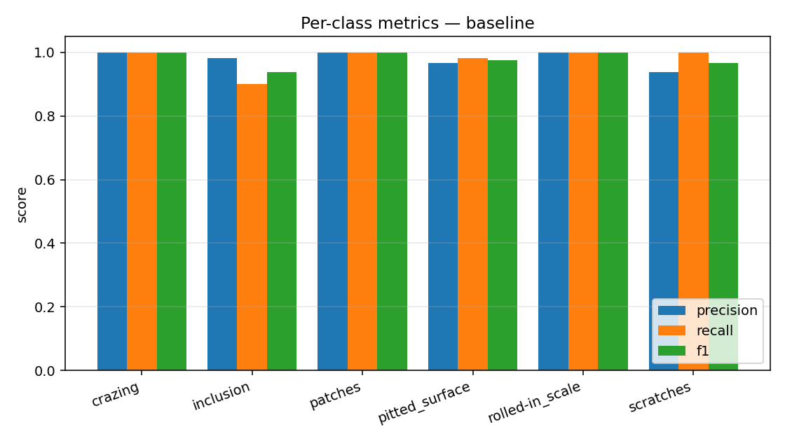

# Industrial Defect Classification — Failure Analysis

End-to-end failure analysis of a steel-surface-defect classifier on the
[NEU-CLS dataset](https://huggingface.co/datasets/newguyme/neu_cls)
(1,800 images, 6 defect classes). The interesting deliverable here is not the
model — a frozen ImageNet ResNet-18 with a linear head clears 98% test accuracy
in a few minutes on CPU — but the toolkit and report that systematically dissect
*where* and *why* the model fails, and quantify which "obvious" fixes actually
help.

## Headline results

| Run         | Augmentation | Test accuracy | Test loss | Notes                          |
|-------------|--------------|---------------|-----------|--------------------------------|
| baseline    | none         | **0.9806**    | 0.128     | Best of the three              |
| flip        | h-flip       | 0.9722        | 0.138     | Slight regression              |
| flip_rotate | h-flip + ±15° rotation | 0.9139 | 0.278   | Rotation breaks elongated defects |





The headline finding is that **standard "always-on" augmentations make the model
worse on this dataset** — not by a small margin, but by 6.7 points of accuracy
in the rotation case. Section 3 of [`findings.md`](findings.md) traces why:
several defect classes (scratches, rolled-in scale) are orientation-bearing
signals, so rotation destroys class-discriminative information rather than
adding invariance. This is the kind of result a debug-minded CV engineer should
*expect* to find on industrial data — and the kind that aggregate metrics on
public benchmarks routinely hide.

## What's in the repo

```
src/
  data.py       NEU-CLS parquet loader, stratified train/val split
  model.py      ResNet-18 backbone (frozen) + linear head, transforms
  train.py      Training loop with per-run config + artefact dump
  analyze.py    The actual deliverable — see "Failure analysis toolkit" below
runs/<name>/
  config.json, metrics.json, model.pt
  test_predictions.csv  (label, pred, top-1 conf, top-2 conf per test image)
  test_features.npy     (penultimate-layer features for the entire test set)
  analysis/
    per_class.{csv,png}, confusion_matrix.png, calibration.png, tsne.png
    confused_pairs/   one image gallery per top-confused (true, pred) pair
    hard_examples/    high-confidence wrong + low-confidence right boards
    summary.json
reports/
  ablation.{csv,png}    cross-run accuracy comparison
  summaries.json        every run's per-class breakdown in one place
findings.md             the writeup — failure modes, root causes, fixes tried
Makefile                make all reproduces every artefact in this repo
requirements.txt
```

## Failure analysis toolkit

`src/analyze.py` produces the following per run:

1. **Per-class precision / recall / F1** with support — bar chart + CSV.
2. **Confusion matrix** as a heatmap.
3. **Confidence-binned accuracy** (calibration). The model is well-calibrated
   on the high-confidence regime (>0.7 confidence → 100% accurate, n=333) and
   uncertain on the long tail (<0.5 confidence → 62.5% accurate, n=8). All 7
   baseline errors have confidence under 0.7.
4. **Most-confused class-pair galleries.** For each of the top-3 off-diagonal
   confusion-matrix entries, dump up to 8 misclassified images sorted by model
   confidence — the fastest way to see whether a confusion is a *labelling
   problem* or a *real visual ambiguity*.
5. **Hard examples board.**
   - "High-confidence wrong": the model was sure but wrong (likely label noise
     or genuinely out-of-distribution samples).
   - "Low-confidence right": the model just barely got it (genuinely ambiguous
     samples worth showing the annotation team).
6. **t-SNE of penultimate features**, plotted twice: coloured by true class
   (cluster structure check) and by correctness (where do errors live in
   feature space?).
7. **Cross-run ablation table** — same metrics across all augmentation regimes,
   side by side.

The toolkit operates on the artefacts emitted by `train.py`, so it works on
*any* run without re-training. That separation is intentional: in practice you
spend more time analysing runs than producing them.

## Reproducing

```bash
make setup     # creates .venv, installs CPU torch + deps
make data      # downloads the parquet files (~70 MB)
make train     # 3 runs × 6 epochs ≈ 12 min on 8-core CPU
make analyze   # writes analysis/ subdirs and reports/
```

Or, equivalently, `make all`.

The ResNet-18 ImageNet weights (~45 MB) are downloaded by torchvision on the
first training run and cached under `~/.cache/torch/hub/`.

## Why this design

The job posting that motivated this project asks for someone who debugs CV
systems through "targeted evaluations rather than only looking at aggregate
metrics" and traces problems through "datasets, labels, augmentations, and
training behaviour". The repo is structured to make every one of those a
first-class concern:

- *Datasets / labels* — `confused_pairs/` and `hard_examples/` galleries make
  label noise visible in seconds.
- *Augmentations* — three runs, one ablation, written up with a hypothesis for
  why each result fell where it did.
- *Training behaviour* — `metrics.json` keeps per-epoch loss + accuracy and
  best-val checkpointing; `findings.md` discusses what the curves imply.
- *Targeted evaluation* — sliced confidence bins and per-class metrics force
  you to look past the aggregate number.

See [`findings.md`](findings.md) for the actual narrative.
